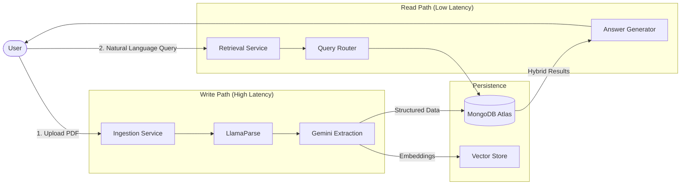
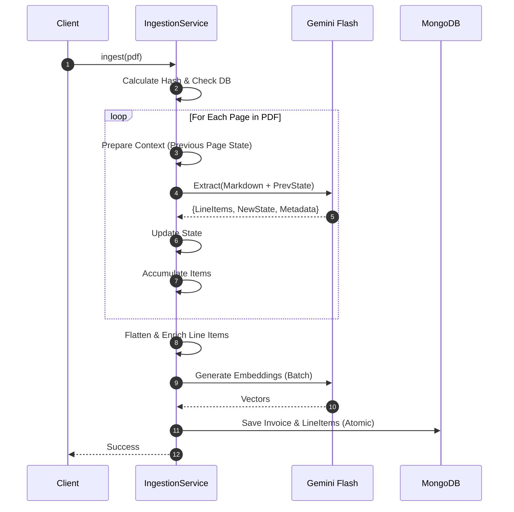
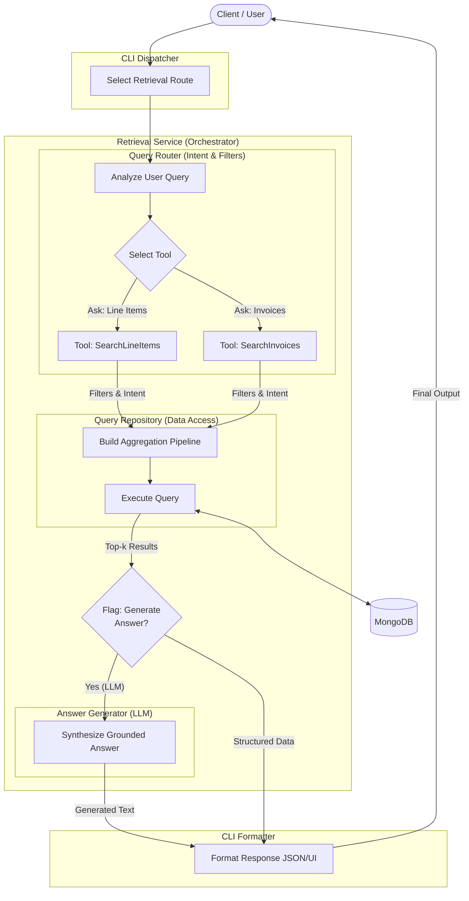
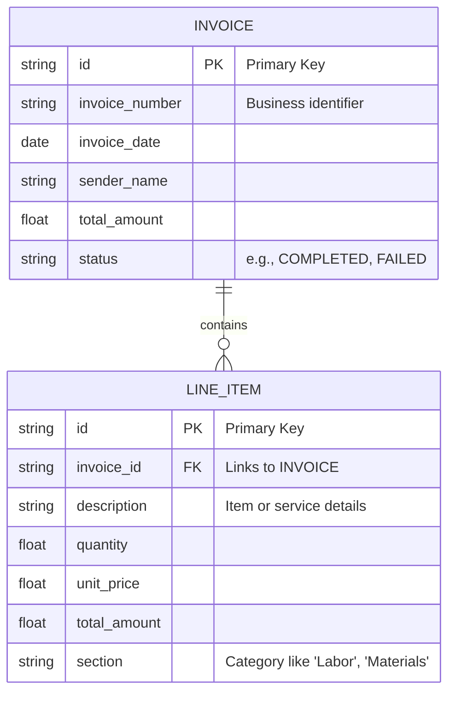

# Invoice Extraction System Architecture

## 1. System Overview

The **Invoice Extraction System** is a domain-specialized RAG (Retrieval-Augmented Generation) application designed to process, structure, and query complex multi-page invoices.

It solves two specific problems:

1. **Extraction:** Converting unstructured PDFs (including headless tables and shifting layouts) into strict, deterministic JSON.
2. **Retrieval:** Enabling natural language querying ("Show me labor costs on Page 3") by combining semantic understanding with precise metadata filtering.

The system utilizes **Logical CQRS** (Command Query Responsibility Segregation) within a Modular Monolith structure to decouple high-compute ingestion from low-latency retrieval.



---

## 2. Module Architecture

The codebase is organized into three distinct packages to enforce separation of concerns.

```text
src/
├── core/                  # SHARED KERNEL (Stateless)
│   ├── models.py          # Persistent DB Models (Beanie/MongoDB)
│   ├── schemas.py         # Transient LLM Extraction Schemas
│   ├── prompts.py         # LLM Prompts
│   └── services/
│       └── embedder.py    # Shared Vector Embedding Service
│
├── ingestion/             # WRITE PATH (Compute Heavy)
│   ├── service.py         # Pipeline Manager (Orchestrator)
│   ├── parser.py          # PDF -> Markdown Adapter
│   ├── cmd_repository.py  # Command DB Access Layer
│   └── extractor.py       # Stateful "Rolling Context" Logic
│
└── retrieval/             # READ PATH (Latency Sensitive)
    ├── service.py         # RAG Facade
    ├── router.py          # Intent Classification & Tool Selection
    └── query_repository.py# Hybrid MongoDB Aggregation Builder
```

### 2.1 Shared Kernel (`core`)

Acts as the connective tissue for the application, strictly limited to stateless definitions and shared utilities.

* **Data Models:** Persistent Beanie/MongoDB models (`Invoice` and `LineItem`) that define the database schema and relationships.
* **LLM Schemas:** Pydantic definitions used for transient validation during the extraction process (handling both single-page and multi-page schemas).
* **Configuration:** Centralized environment settings and API client management to prevent hardcoding.
* **Embedding Service:** A shared wrapper around the embedding model (`GeminiEmbedder`) to ensure vector space consistency between the write (ingestion) and read (retrieval) paths.

### 2.2 The Write Path (`ingestion`)

Responsible for the high-compute workload of converting raw PDFs into structured data.

* **Ingestion Service:** The primary orchestrator that manages the pipeline flow (Deduplication -> Parsing -> Extraction -> Persistence).
* **Invoice Parser:** A wrapper for **LlamaParse** that converts PDFs into layout-aware Markdown, preserving table topology.
* **Invoice Extractor:** Encapsulates the core logic, dynamically applying a fast **Single-Shot** strategy for single-page files or the **Stateful Sequential** algorithm (maintaining "Rolling Context" across page breaks) for complex multi-page documents.
* **Command Repository:** The data access layer responsible for performing atomic writes to MongoDB, ensuring invoices and line items are saved in a single transaction.

### 2.3 The Read Path (`retrieval`)

Responsible for low-latency query resolution and RAG operations.

* **Retrieval Service:** The facade that serves user requests, acting as the entry point for the RAG pipeline.
* **Query Router:** An LLM-based component that analyzes user intent to distinguish between specific metadata lookups and broad semantic searches, extracting structured filters via Function Calling.
* **Query Repository:** Dynamically constructs and executes **Hybrid Search** aggregations. It combines strict metadata filtering (e.g., `page_number`) with semantic vector search in a single MongoDB pipeline.
* **Answer Generator:** The final synthesis layer. It takes the top-$k$ retrieved chunks and the user's original query to generate a grounded, human-readable response.

---

## 3. The Write Path: Ingestion Pipeline

The ingestion process converts raw PDFs into queryable vectors. It prioritizes **accuracy over latency**.

### 3.1 Workflow

1. **Deduplication:** File hash check against MongoDB to prevent redundant processing.
2. **Layout Parsing:** **LlamaParse** converts PDF to Markdown, preserving table topology.
3. **Stateful Extraction:** **Gemini 2.5 Flash** extracts data page-by-page. It maintains a `PageState` (active table headers, current section) to correctly parse "headless" tables on subsequent pages.
4. **Embedding:** A descriptive `search_text` string is generated for each line item and vectorized.
5. **Transactional Save:** Data is persisted to MongoDB.

### 3.2 Sequence Diagram: Rolling Context Extraction



---

## 4. The Read Path: Retrieval & RAG

The retrieval process translates vague user intent into precise database queries. It prioritizes **precision and grounding**.

### 4.1 Workflow

1. **Query Routing:** An LLM analyzes the user prompt to determine intent and extracts structured parameters via Function Calling.
    * *Intent:* "Search Items" vs "Get Invoice Metadata".
    * *Filters:* `page_number`, `date`, `total_amount`.
2. **Hybrid Scope Search:** The repository executes a MongoDB aggregation that:
    * **Pre-filters** using strict canonical fields (e.g., `page_number`).
    * **Vector Searches** within that filtered subset using semantic fields (e.g., `description`).
3. **Synthesis:** The top-$k$ results are fed to the **Answer Generator** (LLM) to craft a human-readable response with citations.

### 4.2 Retrieval Logic Flow



---

## 5. Data Architecture

The system uses a **Flattened Document Model** in MongoDB to optimize for vector search granularity and bypass sparse data issues for 50+-page invoices.

### 5.1 Entity Relationships



### 5.2 Storage Strategy

* **Collection `invoices`:** Stores global document metadata. Used for "Get Metadata" tools.
* **Collection `line_items`:** Stores atomic rows. This is the primary target for Vector Search.
  * **Context Injection:** We do *not* rely on the vector of the word "Labor" alone. We embed:
        > `Context: {Vendor} - {Section} | Item: {Description}`
  * This ensures "Apple" (Fruit) and "Apple" (Tech) are semantically distinct.

---

## 6. Key Algorithms

### 6.1 Stateful Sequential Extraction

* **Problem:** Tables often span multiple pages. Page 2 has numbers but no headers ("Headless Table").
* **Solution:** The extraction loop passes a `PageState` object to the next iteration.
  * If Page 1 ends inside a table, `table_status=OPEN` and `headers=[...]` are passed to Page 2.
  * The LLM uses this injected context to map Page 2's raw values to the correct columns.

### 6.2 Hybrid Scope Search

* **Problem:** Vector search is fuzzy; Metadata search is strict. Users mix them ("Cables on Page 3").
* **Solution:** We classify fields into **Canonical** (Strict) and **Semantic** (Fuzzy).
  * `page_number` is a hard filter (Filter Stage).
  * `description` is a vector target (Search Stage).
  * The database executes `Filter` **before** `Vector Search` to ensure zero hallucinations regarding page numbers.

---

## 7. Technology Stack

| Component | Technology | Rationale |
| :--- | :--- | :--- |
| **Parsing** | [LlamaParse](https://www.llamaindex.ai/llamaparse) | Only solution reliably outputting layout-aware Markdown for tables. |
| **LLM** | Gemini 2.5 Flash | 1M token context window allows full-document awareness; low cost. |
| **Embeddings** | Gemini (`text-embedding-004`) | Optimized for retrieval tasks; 768 dimensions. |
| **Database** | MongoDB Atlas | Single platform for operational data (ACID) and Vector Search. |
| **ODM** | [Beanie](https://beanie-odm.dev/) | Async Python ODM; allows seamless Pydantic-to-MongoDB persistence. |
| **DI** | [wireup](https://maldoinc.github.io/wireup) | Performant, concise and type-safe Dependency Injection. |
| **Orchestrator** | [LlamaIndex](https://www.llamaindex.ai/) | Native support for structured extraction and node management. |
| **CLI** | Typer | Type-safe CLI generation. |
